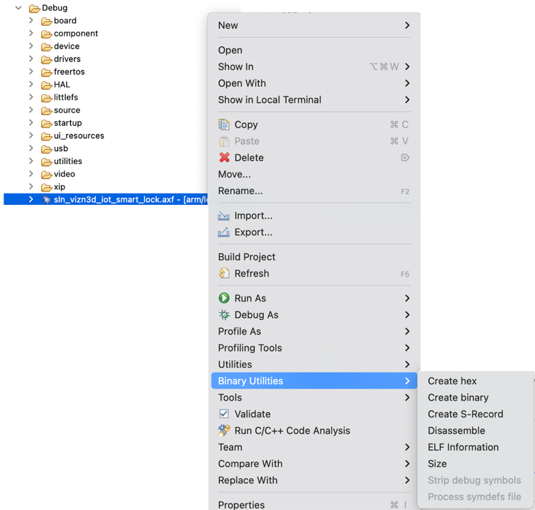

# Application Banks

- Dual application flash banks, **Bank A** and **Bank B**.
- Provides a redundancy mechanism used by the bootloader's update mechanisms.

The SLN-VIZN3D-IOT utilizes a series of dual "application flash banks" used as redundancy mechanism when updating the firmware via one of the bootloader's [update mechanisms](./boot-modes/mass-storage-device-updates.md).

## Addresses

The flash address for each of the application flash banks are as follows:

- Bank A - `0x30100000`
- Bank B - `0x30780000`

## Configuring Flash Bank in MCUXpresso IDE

Configuring the flash bank can be done in MCUXpresso IDE before compiling a project.

1. Right-click the `sln_vizn3d_iot_smart_lock` project in the **Project Explorer** window.
2. Go to **Properties**
3. Click on **MCU Settings**
4. Change `FLASH_BANK` from `0x30100000` to `0x30780000` or vice versa.
5. Build the project

### Convert .axf to .bin

When building a project in MCUXpresso IDE,
the default behavior is to create a `.axf` file.
However, some of the bootloader update mechanisms including [MSD updates](boot-modes/mass-storage-device-updates.md) require the use of a `.bin` file.

Fortunately,
converting a `.axf` file to `.bin` can be done in MCUXpresso without any additional setup.

To perform this conversion, navigate to the project directory which contains your compiled project binary and right-click on the `.axf` file in that directory.

:::info
The binary for your project is likely located in either the **Debug** or **Release** folder depending on your current build config.
:::

In the context menu, select **Binary Utilities->Create binary**.

Verify that the binary has successfully been created.
