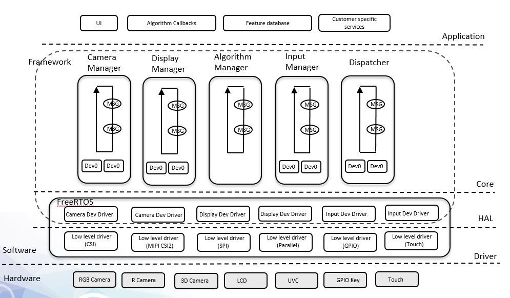

#
# AI-IOT Vision Framework
#
AI-IOT Vision Framework is a hardware-independent framework core for AI-IOT vision applications running on Arm M-Core CPUs using the FreeRTOS platform.

## AI-IOT Vision Solution Introduction


## Motivation

Support various customized modules across different platforms and real customer products

- Different camera interfaces

| Device    | FlexIO | CSI | MIPI | UVC | MIPI 2 CSI |
| --------- | ------ | --- | ---- | --- | ---------- |
| RT106F    | Y      | Y   |      |     | Y          |
| RT117F    | Y      | Y   | Y    |     | Y          |
| Simulator |        |     |      | Y   |            |

- Different camera sensors

| Device    | MT9M114 | GC0308 | HiMax 3D | ORBBEC 3D | OV5640 |
| --------- | ------- | ------ | -------- | --------- | ------ |
| RT106F    | Y       | Y      | Y        | Y         |        |
| RT117F    | Y       | Y      | Y        | Y         | Y      |
| Simulator | Input   |        |          |           |        |

- Different display interfaces

| Device    | Parallel | SPI | MIPI | Simulated Window |
| --------- | -------- | --- | ---- | ---------------- |
| RT106F    | Y        | Y   |      |                  |
| RT117F    | Y        | Y   |      |                  |
| Simulator |          |     |      |                  |

- Different display panels

| Device   | Riverdi(SPI,320x240) | RK024HH243-T(Parallel 240x320) | RK043FN02H-CT(Parallel 480x272) | RK055AHD091-CTG(MIPI 720p) | Others                               |
| -------- | -------------------- | ------------------------------ | ------------------------------- | -------------------------- | ------------------------------------ |
| RT106F   | Y                    |                                |                                 |                            |                                      |
| RT117F   | Y                    | Y                              | Y                               | Y                          |                                      |
| Customer |                      |                                |                                 |                            | Y(each customer has their own panel) |

## Goal

- Decouple the hardware from the Vision algorithm
- Add a HAL to unify the hardware device interface
- Minimize the code changes required to support customer software and hardware customization
- Create a reusable cross-platform core component
- Allow for Agile development based using the FreeRTOS Ubuntu emulator

---

## Architecture



#### **Core**

- Dedicate manager to manage the multiple input devices
- Fully leverage the FreeRTOS task and messaging mechanism
- Define the unified message for the cross task communication

#### **HAL**

- Design a unified data structure and interface for camera, display, input, and output devices
- Provide a hardware-independent interface to the core
- Build a dev database to support multiple devices, and configure desired devices at compile time based on platform in use (106F vs 117F, EVK vs Customer Kit).

## HAL implementation

#### **Camera Dev**

The camera dev abstracts the low level camera device:

```c
typedef struct _camera_dev camera_dev;

enum _camera_event
{
    /* Display finished sending asynchronous the frame, provide another frame */
    CAMERA_SEND_FRAME = MAKE_FRAMEWORK_EVENTS(kStatusGroup_Camera, 1),
    CAMERA_LAST_EVENT
};
typedef enum _camera_event camera_event;

/* callback function to notify camera manager that one frame is dequeued */
typedef int (*camera_dev_callback_t)(const camera_dev *dev, camera_event event, void *param, uint8_t fromISR);

typedef struct
{
    /* initialize the dev */
    int (*init)(camera_dev *dev, int width, int height, camera_dev_callback_t callback, void *param);
    /* deinitialize the dev */
    int (*deinit)(camera_dev *dev);
    /* start the dev */
    int (*start)(const camera_dev *dev);
    /* enqueue a buffer to the dev */
    int (*enqueue)(const camera_dev *dev, void *data);
    /* dequeue a buffer from the dev */
    int (*dequeue)(const camera_dev *dev, void **data, pixel_format *format);
    /* input notify */
    int (*input_notify)(const camera_dev *dev, void *data);
} camera_dev_operator;

typedef struct
{
    /* buffer resolution */
    int height;
    int width;
    int pitch;
    /* active rect */
    int left;
    int top;
    int right;
    int bottom;
    /* rotate degree */
    cw_rotate_degree rotate;
    /* flip */
    flip_mode flip;
    /* swap byte per two bytes */
    int swapbyte;
    /* callback */
    camera_dev_callback_t callback;
    /* param for the callback */
    void *param;
} camera_dev_private_capability;

struct _camera_dev
{
    /* unique id which is assigned by camera manager during registration */
    int id;
    /* name of the device */
    char name[DEVICE_NAME_MAX_LENGTH];
    /* operations */
    const camera_dev_operator *ops;
    /* private capability */
    camera_dev_private_capability cap;
};
```

#### **Display dev**

The display dev abstracts the low level display device:

```c
typedef struct _display_dev display_dev;

enum _display_event
{
    /* Display finished sending asynchronous the frame, provide another frame */
    DISPLAY_REQUEST_FRAME = MAKE_FRAMEWORK_EVENTS(kStatusGroup_Display, 1),
    DISPLAY_LAST_EVENT
};
typedef enum _display_event display_event;

/* callback funtion to notify display manager that one frame is blited */
typedef int (*display_dev_callback_t)(const display_dev *dev, display_event event, void *param, uint8_t fromISR);

typedef enum _hal_display_status
{
    kStatus_HAL_DisplaySuccess = 0,                                              /*!< Successfully */
    kStatus_HAL_DisplayTxBusy  = MAKE_FRAMEWORK_STATUS(kStatusGroup_Display, 1), /*!< Display tx is busy */
    kStatus_HAL_DisplayNonBlocking =
        MAKE_FRAMEWORK_STATUS(kStatusGroup_Display, 2),                        /*!< Display will return immediately */
    kStatus_HAL_DisplayError = MAKE_FRAMEWORK_STATUS(kStatusGroup_Display, 3), /*!< Error occurs on HAL Display */

} hal_display_status_t;

typedef struct
{
    /* initialize the dev */
    hal_display_status_t (*init)(display_dev *dev, int width, int height, display_dev_callback_t callback, void *param);
    /* deinitialize the dev */
    hal_display_status_t (*deinit)(const display_dev *dev);
    /* start the dev */
    hal_display_status_t (*start)(const display_dev *dev);
    /* blit a buffer to the dev */
    hal_display_status_t (*blit)(const display_dev *dev, void *frame, int width, int height);
    /* input notify */
    hal_display_status_t (*input_notify)(const display_dev *dev, void *data);
} display_dev_operator;

typedef struct
{
    /* buffer resolution */
    int height;
    int width;
    int pitch;
    /* active rect */
    int left;
    int top;
    int right;
    int bottom;
    /* rotate degree */
    cw_rotate_degree rotate;
    /* pixel format */
    pixel_format format;
    /* the source pixel format of the requested frame */
    pixel_format src_format;
    void *framebuffer;
    /* callback */
    display_dev_callback_t callback;
    /* param for the callback */
    void *param;
} display_dev_private_capability;

struct _display_dev
{
    /* unique id which is assigned by camera manager during the registration */
    int id;
    /* name of the device */
    char name[DEVICE_NAME_MAX_LENGTH];
    /* operations */
    const display_dev_operator *ops;
    /* private capability */
    display_dev_private_capability cap;
};

```

## HOW TO

- How to add one camera dev?
- How to add one display dev?
- How to customize the GPIO key?
- How to change the UI?
- How to adjust the database?
